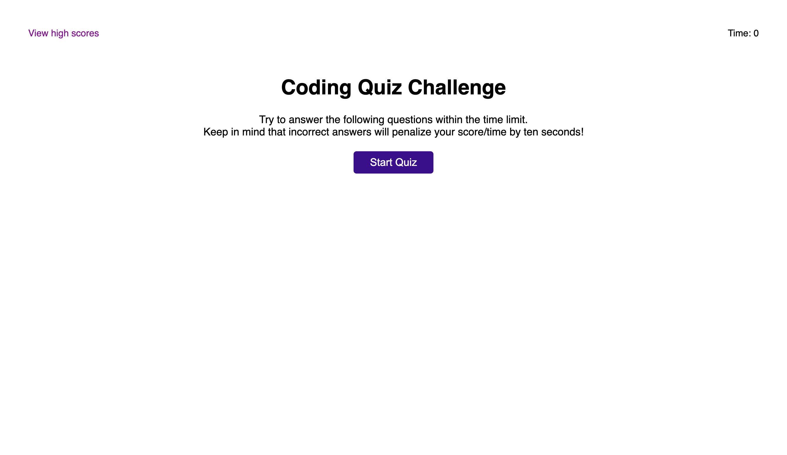
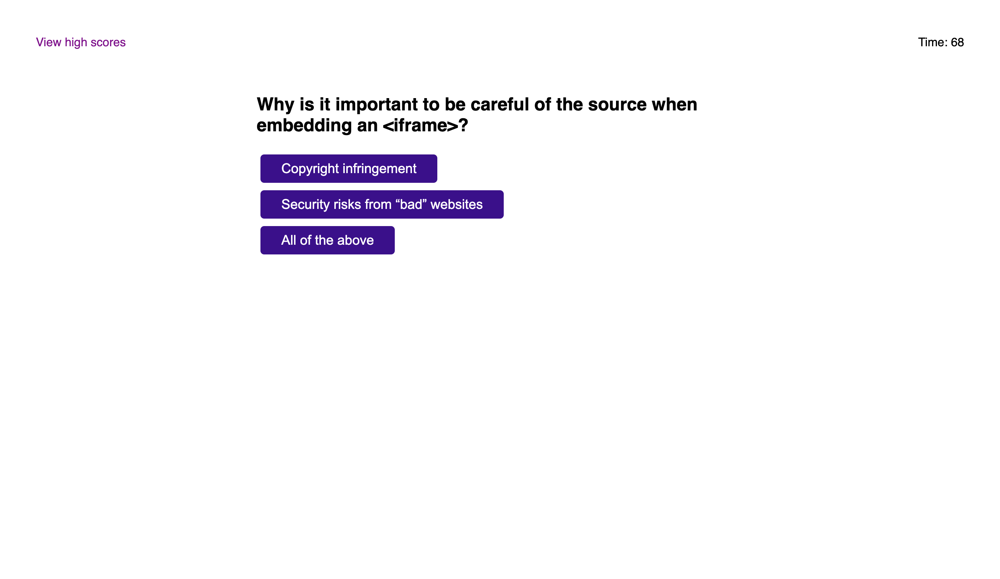
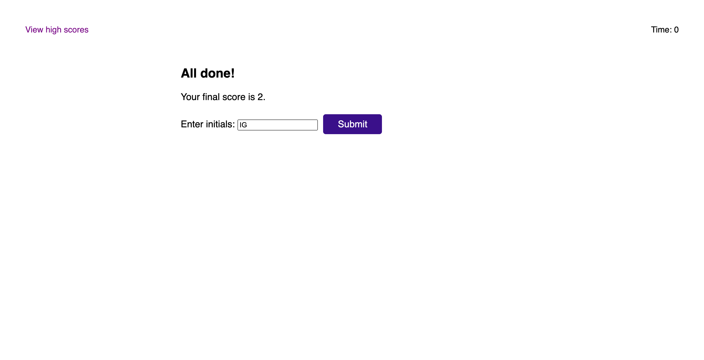
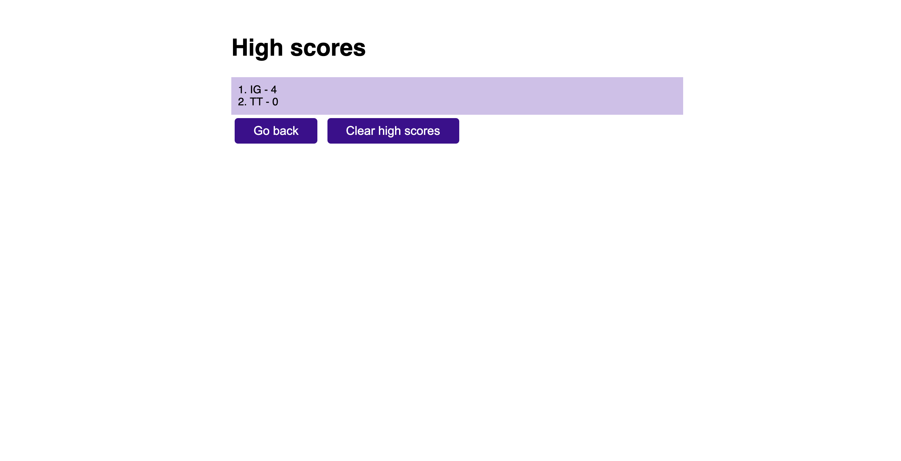

# Code Quiz
​
A timed coding quiz with multiple-choice questions
​
## Technologies Used

* HTML
* CSS
* JavaScript
## Description 

 This app will run in the browser, and will feature dynamically updated HTML and CSS powered by JavaScript code using DOM. The user has 75 secons to complete the quiz. Incorrect answers will penalize the timer by ten seconds. After the quiz is over, the user can save his/her initials and score and gauge the progress compared to others. 

## Usage 
​
To start the quiz click "Start Quiz" button, a timer will start and you will be presented with a question. When you answer a question, you will be presented with another question. If you answer a question incorrectly, time is subtracted from the clock. When all questions are answered or the timer reaches 0, the quiz is over and you can save your initials and highest score. You can see High Scores at any time by clicking "View high scores" at the top-left corner of the page, but it stops the quiz.

## Page View
Different pages

| |   |
| :---:   | :-: | 
| |  | 

## Link
Link to deployed application https://irina-golubitsky.github.io/code-quiz/

---
MIT License
Copyright (c) [2021] [Irina Golubitsky]